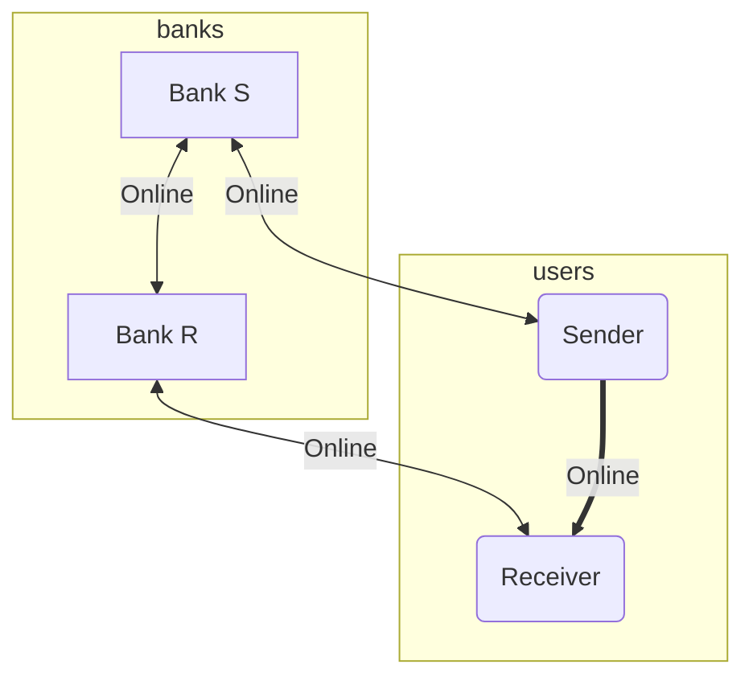
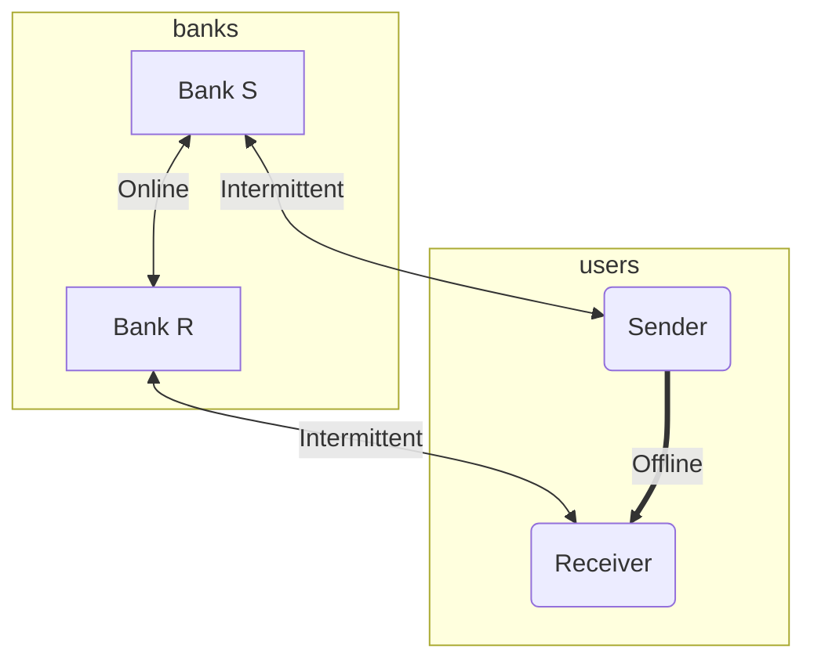

# Offline-first peer-to-peer payment

## Need

[Lattice Innovations](https://thelattice.in) has, in the recent past, developed solutions for island nations in the Pacific. These nations are the most geographically dispersed in the world, with only a handful of urban centers, and a rural population dispersed across islands that dot millions of square kilometers in the largest ocean on Earth.

Access to any service—including banking—requires travel between islands. This is expensive and inconvenient, and disproportionately affects those who can afford it the least. Internet access—on the few occasions that is available—is slow and unreliable.

The digital divide is a fact of life.

What kind of system would serve Pacific Islanders' banking needs? When a seasonal migrant sends money home from Australia or New Zealand, how will it reach their family's purses? This note attempts to address this need.

## Objective

Propose a system design that enables rural communities in the Pacific Islands to use digital payments in lieu of cash for routine, everyday expenses, without depending on the internet. This evolution is illustrated using two simple diagrams, representing the current system versus the proposed system.

### Current system

Digital banking today operates as follows:

Each transaction needs internet connectivity, because the transactions are validated in real-time by the respective banks of the sender and the receiver.

### Proposed system

We propose a system where users can transact while offline. As and when they have internet access—say, once a month—bank records are reconciled.

## Design considerations

To make the proposed system tenable, we have to address design requirements for financial systems. At its core, it is about ensuring that the system is trustworthy. Trust can be deconstructed into the following elements:

1. No double-spending
2. Unforgeability
3. Verifiability
4. Transparency
5. Non-repudiation

The technical architecture to address these aspects, and the constraints and tradeoffs in the proposed approach, shall be covered in the next post in this series.

## References

1. Chu, Y.; Lee, J.; Kim, S.; Kim, H.; Yoon, Y.; Chung, H. Review of Offline Payment Function of CBDC Considering Security Requirements. Appl. Sci. 2022, 12, 4488. https://doi.org/10.3390/app12094488
2. Vanuatu’s Labor migration: Challenges and opportunities. East Asia and Pacific migration core course and conference. [The World Bank document repository](https://thedocs.worldbank.org/en/doc/290a0acf60126b5b49d0032127fb44c8-0070012024/original/2-Vanuatu-s-Labor-migration-Challenges-and-opportunities.pdf), last accessed February 18, 2025.
