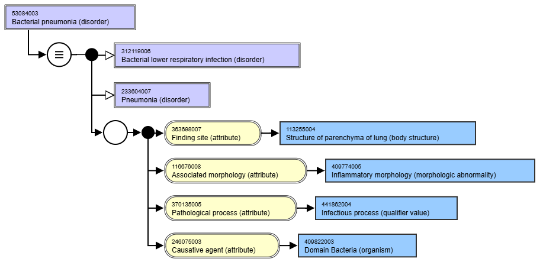

# Why I love SNOMED-CT

`2024-11-11`

Once you enter the realm of organizing healthcare data, whether in individual medical records or in aggregate form, one of the first questions you face is how to represent clinical concepts.

I first encountered this question a decade-and-a-half ago[^1]. I was looking for information about the volumes of certain procedures performed in the United States, in order to estimate market size for the medical device firm that I then worked for.

The search for answers brought me to ICD-9, ICD-10, and CPT codes. ICD is the international classification of diseases, maintained by the World Health Organization. CPT is current procedural terminology, maintained by the American Medical Association. Both use a tree-like hierarchy to organize clinical concepts. So, in ICD-10, “fracture of femur” is nested under “Injuries to the hip and thigh”.

This worked well for understanding diagnosis and treatments in the context of localized surgery. By combining ICD codes with discharge provided by Healthcare Cost and Utilization Project (HCUP), my data needs were fully met.

Fast forward to 2021. That year, I started working on a project to develop a population-wide health registry for the government of Tamil Nadu.

Now, the questions became more interesting. How do you classify bacterial pneumonia? Should it be classified as a respiratory disease? Or a bacterial infection? What if it were a hospital-acquired infection? The nature of classification would change how data would be aggregated. This, in turn, could impact how the state of health was measured, and how quality of care was assessed.

ICD-10 was [not up to the task](#user-content-fn-2)[^2]. While it is an effective classification system, it could not represent the nuance in “bacterial pneumonia”.

That is when I came across SNOMED-CT[^3], an ontology that specifically addressed my “pneumonia question”. An ontology is a way to express what something means, by defining entities or concepts, and establishing relationships between them.

SNOMED-CT allows pneumonia to be associated with multiple other concepts — concepts that represent the affected region (respiratory system), the nature of the disease (inflammation), and its cause (bacterial or viral infection). This is illustrated in the [figure below](#user-content-fn-4)[^4].

<figure><figcaption></figcaption></figure>

The ability to deconstruct a concept into its constituent concepts, and recombine those concepts to create new ones, was quite thrilling. Clearly, the makers of SNOMED-CT agree with me, because they gave a specific name to this activity: post-coordination.

If there is a post, there should be a pre. Indeed, there is. Pre-coordination means that a concept already has a code in the SNOMED-CT vocabulary. Conditions such as “bacterial pneumonia”, or a common bacterial strain such as “Streptococcal pneumonia”, exist as pre-coordinated concepts.

Post-coordination would apply to a concept like "pneumonia caused by the Gardnerella genus", a rare event[^5]. However, because the Gardnerella genus is defined in the SNOMED-CT ontology, it can still be represented using a post-coordinated concept. We have to imitate the structure for  “Streptococcal pneumonia”, then replace Streptococcus with Gardnerella.&#x20;

SNOMED-CT recognizes the limitations of language in describing an idea, but then bends that limitation to its use. It provides axiomatic concepts that can be interconnected to describe more complex ideas.

And by separating the “ingredients” of a concept from its constituents, SNOMED-CT free itself from the need to be verbose. Rather, it provides a fully-specified name, and also provides a host of synonyms across multiple languages.

### This separation of the idea itself, from the words used to represent it, is the true power of SNOMED-CT.&#x20;

It enables terse communication without loss of clarity — which I presume is the goal of any system that organizes information about the world.

### Footnotes

[^1]: A decade-and-a-half feels about 25% longer than 15 years.

[^2]: Some of the structural limitation of ICD-10 have been addressed in ICD-11, but not fully.&#x20;

[^3]: https://www.snomed.org/what-is-snomed-ct, last accessed Sep 3, 2024

[^4]: https://browser.ihtsdotools.org/?perspective=full\&conceptId1=53084003, last accessed Nov 11, 2024

[^5]: De La Noue VDV et al, Gardnerella vaginalis ventilatory acquired pneumonia among patients with trauma, Diag Microbiology and Infectious Disease, 108:4, 2024, https://doi.org/10.1016/j.diagmicrobio.2024.116202
