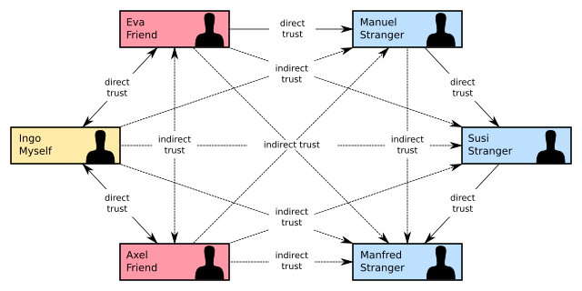

# Trust and digital identity

Identity is become a foundational issue. Who am I? How does the world identify me?

How was identity established earlier? The shopkeeper near our home in Kolkata saw me with my parents, and identified me as their son. Unfortunately, so did the chap who I used to buy cigarettes from.

Now, trust has moved away from the individual and small communities to large institutions. Now, I have to look to the State to tell the world who I am.

This is an impersonal view of the individual.

Can we, and should we, move back to a more personal view? I think we must. I should not have to depend on someone external to give proof of my very existence.

This ideal has to meet the realizable.

What is realizable today is the following—if Akash trusts Xavier, and Xavier trusts Bhushan, then Akash trusts Bhushan. Trust is, to a limited extent, a transferrable property.

If the number of Xaviers who vouch for Bhushan increases, so does Akash's confidence in Bhushan's identity.

When this idea first occurred to me, I was impressed by my own originality. Then, I went looking, and found the concept of "Web of trust"—a well-developed idea in computer science, first described in 1992. The [Wikipedia](https://en.wikipedia.org/wiki/Web_of_trust) entry clearly illustrates this idea.

<figure><figcaption>
Schematic diagram of a Web of Trust. Source: By <a href="https://commons.wikimedia.org/w/index.php?curid=80652637">Kku - Own work</a>, CC BY-SA 4.0
</figcaption></figure>

